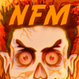

# Need for Madness — native port for Nintendo Switch, PS Vita and Linux

> **This repository is the Switch port.** It starts from the PS Vita / Linux
> native port below (imported unchanged in the first commit) and adds
> `native/platform/switch/`. How to build, install and play it, and what is
> left: [`TASKS_SWITCH.md`](TASKS_SWITCH.md).




An unofficial port of **Need for Madness** (Radicalplay, 2015) to the
**PS Vita** and **Linux**, written in C. The original source code was never
released: the game was decompiled and rewritten line by line, first in
JavaScript/WebGL (`web/`) and then in C (`native/`). The goal is a faithful,
1:1 port. The original `Game.jar`, patched to run on modern Java, stays in
the repository as the reference to compare against.

The game assets (`data/`, `stages/`, `mycars/`, `mystages/`, `music/`) are
the originals, byte for byte, and the port reads them as they are.

---

## Building for the PS Vita

### 1. Requirements

- **VitaSDK** installed (https://vitasdk.org), with its environment set:
  ```sh
  export VITASDK=/usr/local/vitasdk
  export PATH=$VITASDK/bin:$PATH
  ```
- **vitaGL** and **zlib** from VitaSDK's package manager:
  ```sh
  vdpm vitaGL
  vdpm zlib
  ```
- Optional: to drop vitaGL's splash screen before the game, rebuild vitaGL
  without it (the build prints a WARNING while it is still there):
  ```sh
  git clone https://github.com/Rinnegatamante/vitaGL
  cd vitaGL && make clean && make NO_SPLASHSCREEN=1 install
  ```

### 2. Build

From the repository root:

```sh
cmake -S native -B native/build-vita -DNFM_PLATFORM=vita \
      -DCMAKE_TOOLCHAIN_FILE=$VITASDK/share/vita.toolchain.cmake
cmake --build native/build-vita -j
```

### 3. Where the VPK ends up

```
native/build-vita/platform/vita/nfm_vita.vpk
```

The VPK already contains every game asset (`data/`, `stages/`, `music/`,
`mycars/`), the home-screen bubble and the LiveArea. Nothing has to be
copied to the memory card separately.

### 4. Install

Copy `nfm_vita.vpk` to the Vita (over FTP or USB with VitaShell) and install
it from VitaShell. The app shows up as **Need for Madness**, Title ID
`NFMD00001`. Progress is saved in `ux0:data/NFMD00001/`.

### Vita controls

| Button | Action |
|---|---|
| R | accelerate |
| L | brake / reverse |
| Left stick | steer |
| Cross | handbrake (and confirm in menus) |
| Cross + left stick, in the air | stunts: forward/back = loops, sideways = rolls. Only firm, straight pushes count; diagonals and small nudges do nothing |
| Right stick | turn the camera |
| D-pad up | guidance arrow: track ↔ cars |
| D-pad down | radar (minimap + speedometer) |
| Triangle | change camera |
| Square | mute music |
| Select | mute sound effects |
| Start | pause |
| Circle | back, in menus |

The full list, Linux keys included, is in [`CONTROLES.txt`](CONTROLES.txt).

---

## Building for Linux

The Linux target is the development environment: it runs the same code as
the Vita, with SDL2 and OpenGL in place of sceCtrl/vitaGL.

```sh
# dependencies (Debian/Ubuntu)
sudo apt install build-essential cmake libsdl2-dev libgl-dev zlib1g-dev

cmake -S native -B native/build-linux -DNFM_PLATFORM=linux -DCMAKE_BUILD_TYPE=Release
cmake --build native/build-linux -j

# run it from the repository ROOT (the assets are read from there)
native/build-linux/platform/linux/nfm_linux
```

`-DNFM_SHOW_FPS=ON` draws the FPS and the worst frame on screen.

Core tests (run on the host, no window):

```sh
cmake -S native/tests -B native/tests/build && cmake --build native/tests/build -j
cd native/tests/build && ctest
```

---

## What the native port does

The whole game runs: boot, menus, car and stage selection, races against the
AI, replays, pause, win/lose screens and saved progress across the NFM 1 and
NFM 2 campaigns and Free Play.

**Faithful to the original**
- Physics, collisions, AI, checkpoints, damage and stunts translated from the
  Java with the same arithmetic (wrapping 32-bit ints, float32 rounding),
  checked against the original jar with differential tests.
- Rendering with no depth buffer, by submission order, as in the original:
  sky, ground, fog, shadows that follow ramps, dust, sparks, flames, the
  repair ring.
- Motion blur and screen shake through the same mechanism as the original
  `paint()` (alpha-blending frames).
- The original boot sequence: loading screen with the blue bar,
  "Click/Press to Start", the Radicalplay intro.
- 1:1 menus: main menu, game modes, instructions (every page, with Vita
  button art), credits, car selection with the spinning car, stage selection
  with the camera flying over the track, locked stages.
- The **stage presentation card** before every race: Coach Insano's hint,
  "Loading complete! Press Start to begin..." and the blinking START button.
- The camera fly-around the cars before the 3-2-1-GO countdown.
- The original pause menu (resume, instant replay, instructions, quit) and
  the highlight replay at the end of a race.
- The original HUD: damage, power, position, laps, wasted, speedometer,
  radar, guidance arrow, stunt messages.

**Audio**
- **Music identical to the original, byte for byte**: the game's MOD renderer
  (`ModSlayer` + `SuperClip`) was translated to C (`native/core/radical_mod.c`).
  All 34 tracks come out identical to what the jar produces, loop points
  included, along with the original's characteristic gritty sound. A test
  checks this.
- Menu music from car selection until a stage is confirmed, each stage's
  music with its original BPM, speed and volume, and `party.zip` on stage 27
  of NFM 2.
- Every sound effect: engines (5 types × 5 revs), air, crashes, skids,
  scrapes, countdown, checkpoint, repair, wasted.

**Extras in this port**
- A **Settings** screen in the pause menu: motion-blur intensity from 0 to
  100 in steps of 20, saved between sessions.
- A control scheme designed for the Vita (table above).
- Home-screen bubble and LiveArea made from the game's own main-menu art
  (`native/platform/vita/make_livearea.py` regenerates them).

**Performance**
- The race draws once per physics tick (53 ms, as in the original) and the
  menus every 40 ms, presenting the last frame in between, which cuts two
  thirds of the drawing work without changing what is on screen.
- Instructions per race frame down from 13.25M to 8.68M (sorting, stack
  buffers, inlined functions, fewer render passes).
- Memory leaks fixed (car copies in the replay ring, per-race HUD textures).

**Still different from the original**
- Text uses a 5×7 uppercase-only vector font; the original uses Arial bold.
  This is the biggest visual difference left.
- Online multiplayer exists in the web port, not in the native one.
- The Vita target builds and runs on hardware, but every change is tested on
  Linux first; the most recent ones (controls, LiveArea) still need to be
  checked on the device.

---

## Repository layout

| Folder | Contents |
|---|---|
| `native/` | **The native port.** `core/` is the platform-independent game (physics, rendering, audio, decoders); `platform/common/game.c` is the game loop and menus; `platform/linux/` and `platform/vita/` are each target's thin layer; `tests/` are the core tests. |
| `web/` | The JavaScript/WebGL port the C was translated from. Open `index.html` with `python3 -m http.server 8123`. |
| `decompilation/` | The decompiled Java (`java-src/`), a reading reference, not a build input. |
| `java/` | The original `Game.jar` patched for modern Java (`./start.sh`) and the untouched original (`Game.jar.bak`). |
| `data/`, `stages/`, `mycars/`, `mystages/`, `music/` | Original assets, **do not modify**. `data/vita/` holds the Vita button art (generated by `tools/gen_vita_assets.py`). |
| `tools/` | Helper scripts (Vita art, music). |

## Documentation for contributors

- [`native/PORT_SPEC.md`](native/PORT_SPEC.md) — the native port's rules.
- [`native/TASKS_NATIVE.md`](native/TASKS_NATIVE.md) — what was done, how it was verified and what is left.
- [`WORK.md`](WORK.md) — discoveries and pitfalls, one per line (for example: the decompiled `RadicalMod` constructor is wrong; the `intToBytes16` bug that gives the music its sound).
- [`AGENTS.md`](AGENTS.md) — how to run, measure and verify; the invariants that must not break (no depth buffer, one draw call in submission order).
- [`web/TRANSPILE_SPEC.md`](web/TRANSPILE_SPEC.md) — the Java → code translation contract (integer overflow, float32).

To compare with the original: `./start.sh` runs the jar. For automatic
screenshots of any of the jar's screens, it can be driven with
`java.awt.Robot` under `xvfb-run` (see `WORK.md`).

---

*Need for Madness © Radicalplay. A non-commercial fan project.*
